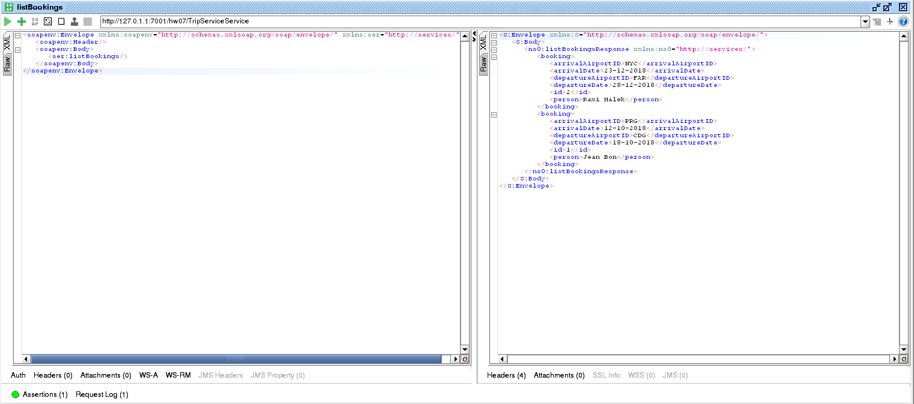

# Homework 07 - Web Services

## Web Service

The service is composed of 4 functions, as CRUD operations (Create, Read, Update, Delete).
Each booking is composed of the following attributes, as you can see in the constructor :
```java
public Booking(int id, String person, String arrivalDate, String departureDate, String arrivalAirportID, String departureAirportID) {
		super();
		this.id = id;
		this.person = person;
		this.arrivalDate = arrivalDate;
		this.departureDate = departureDate;
		this.arrivalAirportID = arrivalAirportID;
		this.departureAirportID = departureAirportID;
	}
```

Below you can take a look at the service and its functions :  
```java
@WebService
public class TripService {
	
	 @WebResult(name="booking")
	 public ArrayList<Booking> listBookings() {
		 DB db = DB.getInstance();
		 return db.getAllObjects();
	 }
	
	 @WebResult(name="booking")
	 public Booking addBooking(@XmlElement(required=true) @WebParam(name="passenger") String passenger, @XmlElement(required=true) @WebParam(name="arrivalDate") String arrivalDate,
			 @XmlElement(required=true) @WebParam(name="departureDate") String departureDate, @XmlElement(required=true) @WebParam(name="arrivalAirportID") String arrivalAirportID,
			 @XmlElement(required=true) @WebParam(name="departureAirportID") String departureAirportID) {
		 if(!passenger.isEmpty() && !arrivalDate.isEmpty() && !departureDate.isEmpty() && !arrivalAirportID.isEmpty() && !departureAirportID.isEmpty()) {
			 DB db = DB.getInstance();
			 Booking t = new Booking(db.getAllObjects().size() + 1, passenger, arrivalDate, departureDate, arrivalAirportID, departureAirportID);
			 db.addObject(t);
			 return t;
		 } else {
			 return null;
		 }
	 }
	 
	 @WebResult(name="message")
	 public String removeBooking(@XmlElement(required=true) @WebParam(name="bookingID") int bookingID) {
		 DB db = DB.getInstance();
		 if(db.getObject(bookingID) != null) {
			 db.removeObject(bookingID);
			 return "Booking removed";
		 } else {
			 return "Booking not found";
		 }
	 }
	 
	 @WebResult(name="booking")
	 public Booking updateBooking(@XmlElement(required=true) @WebParam(name="bookingID")int id, @XmlElement(required=true) @WebParam(name="passenger") String passenger,
			 @XmlElement(required=true) @WebParam(name="arrivalDate") String arrivalDate, @XmlElement(required=true) @WebParam(name="departureDate") String departureDate,
			 @XmlElement(required=true) @WebParam(name="arrivalAirportID") String arrivalAirportID, @XmlElement(required=true) @WebParam(name="departureAirportID") String departureAirportID) {
		 if(!passenger.isEmpty() && !arrivalDate.isEmpty() && !departureDate.isEmpty() && !arrivalAirportID.isEmpty() && !departureAirportID.isEmpty()) {
			 DB db = DB.getInstance();
			 Booking b = db.getObject(id);
			 if(b != null) {
				 b.setPerson(passenger);
				 b.setArrivalDate(arrivalDate);
				 b.setDepartureDate(departureDate);
				 b.setArrivalAirportID(arrivalAirportID);
				 b.setDepartureAirportID(departureAirportID);
			 }
			 return b;
		 } else {
			 return null;
		 }
	 }
}
```

## SoapUI

The SoapUI project has a Test Suite, composed of 6 Test Cases, one for each operation plus two of them being the booking listing to check if Creation and Deletion has been done.  
You can find the SoapUI project [here](https://gitlab.fit.cvut.cz/mi-mdw/B181/en/picarnic/blob/master/homeworks/hw07/HW07-soapui-project.xml).  
You can see each test case in the test suite in the following screenshot :  


### Test Case 01 - List Bookings

This test case has an **XPath Match** assertion where we check the number of bookings returned.  
This XPath expression is the following : **count(//*:listBookingsResponse/*:booking)**  
We are expecting 2 bookings as the server database is in its original state so we put 2 in the expected content.

### Test Case 02 - Add Booking

This test case has an **XPath Match** assertion where we check the number of bookings returned.  
This XPath expression is the following : **count(//*:addBookingResponse/*:booking)**  
We are expecting 1 booking as the server should return the created booking if it was successful.

### Test Case 03 - Update Booking

This test case has an **XPath Match** assertion where we check the number of bookings returned.  
This XPath expression is the following : **count(//*:updateBookingResponse/*:booking)**  
We are expecting 1 booking as the server should respond with the updated booking so we put 1 in the expected content.

### Test Case 04 - List Bookings (after creation)

This test case has an **XPath Match** assertion where we check the number of bookings returned.  
This XPath expression is the same as the first one : **count(//*:listBookingsResponse/*:booking)**  
We are expecting 3 bookings as we created a booking before so we put 3 in the expected content.
We can also see that the booking with the id 3 has been successfully updated before.

### Test Case 05 - Remove Booking

This test case has an **Simple Contains** assertion where we check if the returned message validates the deletion.  
We are expecting a **Booking removed** message if the booking is successfully removed, so we put *Booking removed* in the expected content.

### Test Case 04 - List Bookings (after removal)

This test case has an **XPath Match** assertion where we check the number of bookings returned.  
This XPath expression is the same as the first one : **count(//*:listBookingsResponse/*:booking)**  
We are expecting 2 bookings as we removed a booking before (the one with the id of 3), so we put 2 in the expected content.