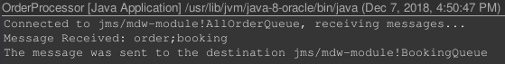

# Homework 09 - JMS - Message Forwarding

## WebLogic Server Configuration

As you can see on the following screenshots, I used the jms module from the 5th tutorial.  


I created two more queues in it to get the following:


The three queues are **AllOrderQueue, BookingQueue and NewTripsQueue**.

## Testing

The only thing to change for testing is the [OrderClientProducer](https://gitlab.fit.cvut.cz/mi-mdw/B181/en/picarnic/blob/master/homeworks/hw09/orderclient/src/jms/OrderClientProducer.java)
message in the **main** method.
```java
public static void main(String[] args) throws Exception {
    	/* Comment the message you do not want to send */
    	
    	String msg = "order;booking";
        String msg = "order;new trip";
        
        String queueName = "jms/mdw-aoqueue";
        
        // create the producer object and send the message
        OrderClientProducer producer = new OrderClientProducer();
        producer.send(queueName, msg);
    }

```

## Booking message

In this scenario the Order client submits a "booking" order. Below you can see the timeline of events and logs.
  
  
  

## New Trip message

In this scenario the Order client submits a "new trip" order. Below you can see the timeline of events and logs.
  
  
  