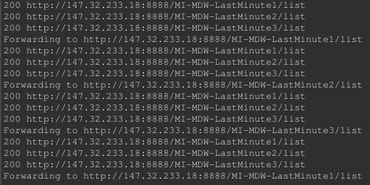

# Homework 10 - Simple “Server-side” load balancing

## Service Monitoring
The service monitoring is assured with the function **monitor()**.
```java
private void monitor() {
		for(int i = 1; i <= 3; i++) {
			try {
				String url = String.format("http://147.32.233.18:8888/MI-MDW-LastMinute%d/list", i);
				HttpURLConnection connection = (HttpURLConnection) (new URL(url)).openConnection();
				connection.setRequestMethod("GET");
				int code = connection.getResponseCode();
				System.out.println(code + " " + url);
				if(code == 200) {
					// add to healthy
					addToHealthy(i);
				} else {
					// add to down
					addToDown(i);
				}
			} catch(Exception e) {
				e.printStackTrace();
			}
		}
	}
```
It checks the status code of each service and, if it is `200 OK` then it adds it to the healthy list (if the service was not already healthy), otherwise if it is another status code, it adds the service index to the down list (if the service was not already down too).  
This monitoring function is called upon each `GET` request to our server, before forwarding.

## Load Balancing

The load balancer is implemented with a proxy servlet and another function to get the service to forward the request to. The **getServer()** function gets the next healthy service index in the list with a **round robin** algorithm.
```java
private static int getServer() {
		if(healthy != null && !healthy.isEmpty()) {
			Integer[] servs = healthy.toArray(new Integer[healthy.size()]);
			return servs[SERVER_INDEX.getAndAccumulate(servs.length, (cur, n)->cur >= n-1 ? 0 : cur+1)];
		} else {
			return -1;
		}
	}
```
And this is the forwarding part:
```java
protected void doGet(HttpServletRequest request, HttpServletResponse response) throws ServletException, IOException {
		int server = getServer();
		monitor();
		if(!healthy.isEmpty() && healthy.contains(server)) {
			String url = String.format("http://147.32.233.18:8888/MI-MDW-LastMinute%d/list", server);
			HttpURLConnection connection = (HttpURLConnection) (new URL(url)).openConnection();
			// HTTP method
			connection.setRequestMethod("GET");
			// copy headers
			Collections.list(request.getHeaderNames()).forEach(head -> connection.setRequestProperty(head, request.getHeader(head)));
			// copy body
			BufferedReader inputStream = new BufferedReader(new InputStreamReader(connection.getInputStream()));
			String inputLine;
			ServletOutputStream sout = response.getOutputStream();
			while ((inputLine = inputStream.readLine()) != null) {
				sout.write(inputLine.getBytes());
			}
			// close
			inputStream.close();
			System.out.println("Forwarding to " + url);
			sout.flush();
		} else {
			response.setStatus(500);
		}
	}
```

## Testing

We can test our load balancer by executing requests with cURL and looking at the Eclipse console. The cURL request is the following:

```bash
curl -v http://127.0.0.1:7001/hw10
```

And here is the response:

```bash
*   Trying 127.0.0.1...
* Connected to localhost (127.0.0.1) port 7001 (#0)
> GET /hw10/ HTTP/1.1
> Host: localhost:7001
> User-Agent: curl/7.47.0
> Accept: */*
> 
< HTTP/1.1 200 OK
< Date: Fri, 07 Dec 2018 17:59:05 GMT
< Transfer-Encoding: chunked
< 
* Connection #0 to host localhost left intact
<?xml version="1.0" encoding="UTF-8"?><records>    <record type="trip">        <id>1</id>        <location>Bohemian Switzerland</location>        <capacity>5</capacity>        <occupied>1</occupied>    </record></records>
```
Pretty version of XML body:
```xml
<?xml version="1.0" encoding="UTF-8"?>
<records>
    <record type="trip">
            <id>1</id>
            <location>Bohemian Switzerland</location>
            <capacity>5</capacity>
            <occupied>1</occupied>
    </record>
</records>
```

To ensure that our request was forwarded to one of the pool services, we can take a look at the following screenshot.  
